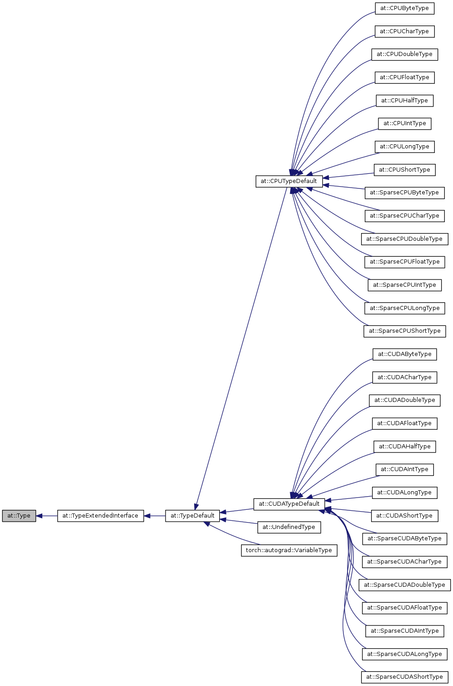

# The origin of PyTorch methods

## Tensor

At the top of high-level libtorch C++ API is the `at::Tensor` class. It provides a comprehensive set
of methods for tensor storage management, data initialization, auto-differentiation, as well as all
basic tensor operations. It is defined at
[ATen/core/Tensor.h](https://github.com/pytorch/pytorch/blob/master/aten/src/ATen/core/Tensor.h)

`Tensor` class itself does not implement much functionality. Storage management is done in
`TensorImpl` class, and `Tensor` just holds a reference-counting pointer to it. That allows to have
several tensors referencing to the same storage (or slices of it).

`Tensor` dispatches tensor methods to proper implementation, depending on data type and backend.
The routing happens in the `TensorImpl::type()` method, and at the top level all tensor
operations look like e.g.

```C++
inline Tensor Tensor::log10() const {
    return type().log10(*this);
}
```

(implemented in
[ATen/core/TensorMethods.h](https://github.com/pytorch/pytorch/blob/master/aten/src/ATen/core/TensorMethods.h))

## TensorImpl

Source
[ATen/core/TensorImpl.h](https://github.com/pytorch/pytorch/blob/master/aten/src/ATen/core/TensorImpl.h).

`TensorImpl` holds the tensor data (as `at::Storage storage_` member) along with the tensor's
dimensions and strides.

`TensorImpl` also implements the routing for tensor operations in `TensorImpl::type()` method. The
actual routing is defined in the `LegacyTypeDispatch` singleton. It holds a rectangular matrix of
`Type` elements. One dimension of that matrix corresponds to scalar types (e.g. `int` or `float`),
and another one to backends (sparse or dense, CUDA or CPU).

(source at
[ATen/core/LegacyTypeDispatch.h](https://github.com/pytorch/pytorch/blob/master/aten/src/ATen/core/LegacyTypeDispatch.h))

## Type

`Type` is the base class for backend- and type-specific operations on tensors. Its source is a good
reference on what operations a tensor should support:
[ATen/core/Type.h](https://github.com/pytorch/pytorch/blob/master/aten/src/ATen/core/Type.h).

Code for classes that inherit from `Type` are **generated** at the build time. There is a
`Type`-derived class for each combination of the backend and scalar type. Entire `Type` hierarchy
looks like this:



## Code generation

Code generation is a stage in CMake. That is, one has to run the build to see the generated files. A
Python script, `gen.py`, takes templates of C++ `.h` and `.cpp` files from `ATen/templates/`
directory, and expands `${...}` placeholders with type- and backend-specific code (and comments!).
